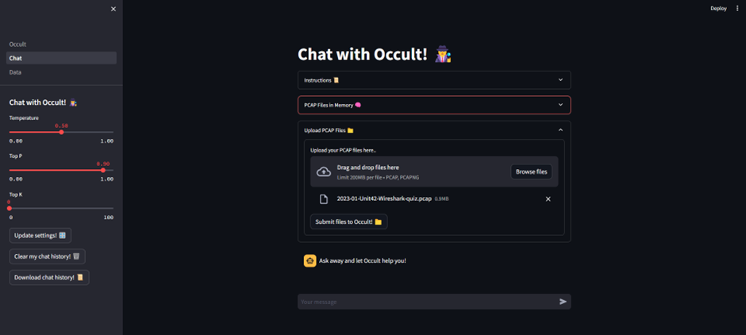
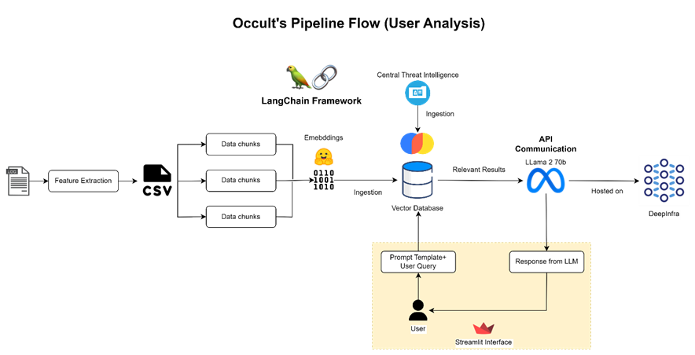

# Occult 🕵️
> A question-and-answer (Q&A) AI system 🤖 that helps security analysts uncover the stories behind their PCAP files. 📄

## Table of Contents
- [Occult 🕵️](#occult-️)
  - [Table of Contents](#table-of-contents)
  - [What's Occult? 🤔](#whats-occult-)
  - [Why Occult? 🤷‍♂️](#why-occult-️)
  - [How Occult Works 🛠️](#how-occult-works-️)
  - [How was Occult Made? 🧑‍🍳](#how-was-occult-made-)
  - [Occult's Features 🤖](#occults-features-)
  - [Occult Architecture 🔨](#occult-architecture-)

## What's Occult? 🤔
Occult is a proof-of-concept AI application developed by Diploma in Infocomm Security Management (DISM) students from Singapore Polytechnic (SP). The aim of this project is to explore how the growing power of Large Language Models (LLMs) can be harnessed to assist security analysts in resource-intensive tasks like network log analysis.

## Why Occult? 🤷‍♂️
Tasks like network log analysis can be time-consuming ⏰ and resource-intensive. 🥱 Security analysts often have to sift through large volumes of network logs 📃 to identify potential security threats. ⚠️

This puts a heavy cognitive load on the security analyst 🤯, and can be a bottleneck 🍾 in the security operations process. Moreover, the manual nature of this process can also lead to human errors and an increase in unknown-unknowns ❓ and false positives. ❌

This motivated the group to devise a problem statement:

> **"How can we leverage LLMs to assist security analysts in network log analysis?"**

The goal of this project is to research how cutting-edge LLMs and techniques be used to automate the process of network log analysis 🧠, and to develop a proof-of-concept AI application that demonstrates this use case.

Occult aims to assist security analysts by introducing a conversational question-answering approach to network log analysis using a ChatGPT-style interface. 🤖💬

This allows security analysts to ask questions about their network logs in _natural language_, and receive answers in a conversational manner. 🦜 This approach is designed to help security analysts uncover insights behind their network logs and identify potential security threats 🚨 more efficiently whilst reducing the cognitive load on the analyst. 🧠

## How Occult Works 🛠️
Occult utilises a relatively new framework called **Retrieval Augmented Generation (RAG)** to perform question-answering 🤔 on network logs. RAG combines the strengths of both retrieval-based and generation-based models. It uses a retriever to find relevant documents from a large corpus and then uses a generator to produce answers based on the retrieved documents. This allows Occult to provide accurate and relevant answers to questions about network logs, while also being able to generate new insights 📊 based on the retrieved documents.

Prompt engineering ⚙️ is a key part of Occult's design. The group has carefully curated a series of prompt templates 🗨️ that are designed to condition the model to understand and answer questions about network logs. These prompt templates are designed to guide the model to understand the structure and content of network logs, and to provide accurate and relevant answers to questions about them.

To give Occult the ability to detect suspicious packets in network logs, the group also built a vector database that houses the knowledge base of Occult. The knowledge base contains a vast array of specially curated malware articles, resports, and indicators-of-compromose (IOCs).

## How was Occult Made? 🧑‍🍳
> Fun fact: Occult was developed entirely with Python! 🐍

- **Front-End** -> Streamlit 🎈
- **Back-End** -> FastAPI ⚡
- **LLMs** -> Google PaLM 🌴, Meta Llama2 🦙
- **Vector Databases** -> ChromaDB 🌈
- **Version Control** -> Git 🐙
- **Integration** -> LangChain 🦜🔗
- **Embedding** -> HuggingFace 🤗

## Occult's Features 🤖
- 🦜 User-friendly chat interface
- 📂 PCAP file upload support
- 📊 Data visualisations of PCAP file data
- 📚 Knowledge base of malware articles and IOCs
- 💬 Prompt-based chart generation

## Occult Architecture 🔨

